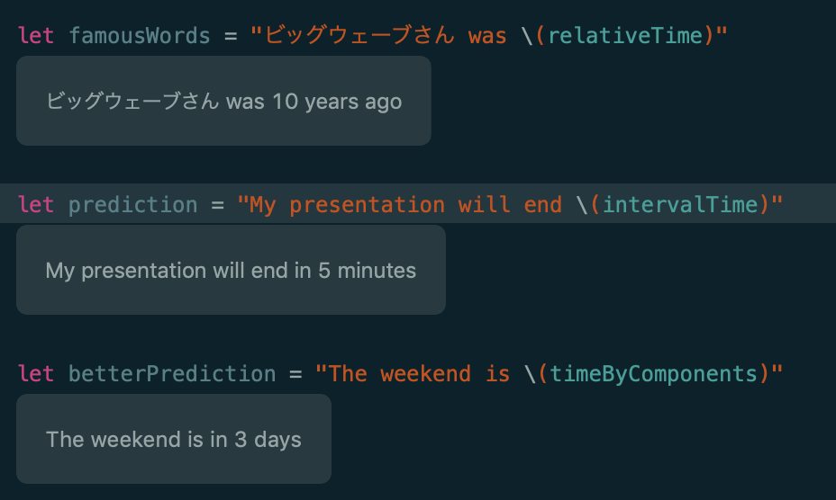
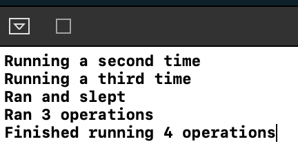
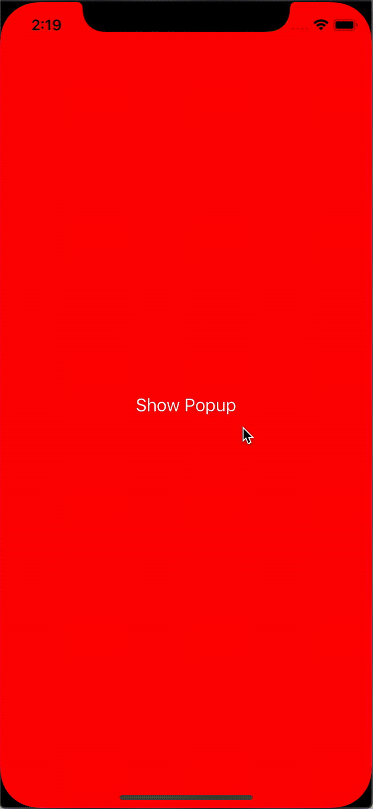

# WWDC 2019: Hidden Amazement  

Bruce Evans  
**LINE** App Dev 2  

[.footer: *LINE / Github / Twitter: @brevansio*]  

^ Work on LINE Messaging  
^ Things I was interested in

---  

[.text-emphasis: #00FF00, Arial]
[.text-strong: #1C1C1C]

# App Store  

*•* watchOS 6 Apps are *not* included in iOS cellular download limit
**▌▌** *•* Older watchOS gets app thinning 
*•* Review Guidelines 
**▌▌** *•* No 3rd party tracking in apps for Kids  
**▌▌** *•* No digital commerce in HTML games (inside apps)  
**▌▌** *•* "Sign in with Apple" *mandatory* if you support 3rd party sign in
*•* App Deletions can be viewed in App Store Analytics  

^ LINE is very big
^ 3rd Party includes annonymous  
^ Sign in With Apple slipped by  
^ Spike in deletions vs drop in users

---  

#[fit] Dependency Injection with `UIStoryboard`  

```swift  

// Link via Segue

@IBSegueAction func followMySegue(coder: NSCoder) -> MyViewController {
	return MyViewController(coder: coder, name: "Initial")
}  


// Instantiate via Code

let initialVC = storyboard?.instantiateInitialViewController(creator: 
{ coder -> UIViewController? in
    let viewController = MyViewController(coder: coder, name: "Initial")
    return viewController
})

let followupVC = storyboard?.instantiateViewController(identifier: "MyViewController", 
                                                       creator: 
{ coder -> UIViewController? in
    let myController = MyViewController(coder: coder, name: "ViewController Jr.")
    return myController
})
```

^ Custom initializers  
^ Pass state / data  
^ Still builds from the storyboard!  

---


# `RelativeDateFormatter`  

```swift  
let formatter = RelativeDateTimeFormatter()
let relativeTime = formatter.localizedString(for: dayOfLegend!, relativeTo: now)
let intervalTime = formatter.localizedString(fromTimeInterval: 300)
let timeByComponents = formatter.localizedString(from: untilWeekend)
```  

^ No more diff’ing times  
^ Localized  
^ Readable "countups" and "countdowns"    

---  

  

^ Not very flexible or customizable

---  

## `ListFormatter`

```swift
ListFormatter.localizedString(byJoining: ["Sushi", "Hamburger", "Pizza"]
  
let formatter = ListFormatter()
formatter.string(from: ["Sushi", "Hamburger", "Pizza"]

// Both return "Sushi, Hamburger, and Pizza"
```    

## Can read Siri’s prompt style  

```swift  
AVAudioSession.PromptStyle.none
AVAudioSession.PromptStyle.normal
AVAudioSession.PromptStyle.short
```

^ `ListFormatter`: Similar to `RelativeDateFormatter`  
^ `ListFormatter`: Missing 'or'  

^ `Siri`: Type of prompt / length
^ `Siri`: Only a get  

---  

# Discresionary BG tasks  

```swift  
let config = URLSessionConfiguration.background(withIdentifier: "test.url")
config.isDiscretionary = true
config.allowsExpensiveNetworkAccess = false
let session = URLSession(configuration: config)
let downloadTask = session.downloadTask(with: url)
downloadTask.countOfBytesClientExpectsToReceive = 1_073_741_824
```  

```swift
let processingRequest = BGProcessingTaskRequest(identifier: "test.request")
processingRequest.requiresExternalPower = true
processingRequest.requiresNetworkConnectivity = true
try BGTaskScheduler.shared.submit(processingRequest)
```  

^ Discretionary meaning  
^ More interestingly: when charging

^ `BGProcessingTask` only runs when idle; requiring power and network further limits 

---  

#[fit] `OperationQueue.addBarrierBlock`  

```swift  
let operationQueue = OperationQueue()
operationQueue.maxConcurrentOperationCount = 5
var opCount = 0
operationQueue.addOperation {
    opCount += 1
    sleep(3)
    print("Ran and slept")
}
operationQueue.addOperation {
    opCount += 1
    print("Running a second time")
}
operationQueue.addOperation {
    opCount += 1
    print("Running a third time")
}
operationQueue.addBarrierBlock { print("Ran \(opCount) operations") }
operationQueue.addOperation {
    opCount += 1
    print("Finished running \(opCount) operations")
}
```

^ Blocks until current queue completes  

---  

#[fit] `OperationQueue.addBarrierBlock`  

  

^ You can see... 

---

#[.fit] `NSData.compress(using:)`

```swift  
let compressedData = try! data.compressed(using: .zlib)
print(data.length < compressedData.length)  // true (usually)

let decompressedData: NSData = try! compressedData.decompressed(using: .zlib)
print(data.isEqual(to: decompressedData as Data))   // true


let decompressAgain = try? decompressedData.decompressed(using: .zlib)  // nil
```  

^ Useful with networking  
^ Compressing small data
^ Was quirky on Xcode 11b1

---  

[.text-emphasis: #00FF00, Arial]

  

|||
| --- | --- |  
| *•* Swipe to Dismiss | *•* Haptic Use |  
| *•* MetricKit | *•* Low Data Mode |  
| *•* Per-App Languages | *•* `git stash` in Xcode |  
| *•* Text Catalogs | *•* WebSockets |  
| *•* Collection Diffing | *•* Read / Write NFC |
| *•* Augmenting CoreML models on device | |  

^ Lots more small changes


---  

[.text: alignment(center)]

[.footer: @brevansio]  

# Thanks  

  

[https://github.com/brevansio/wwdc2019meetup](https://github.com/brevansio/wwdc2019meetup)